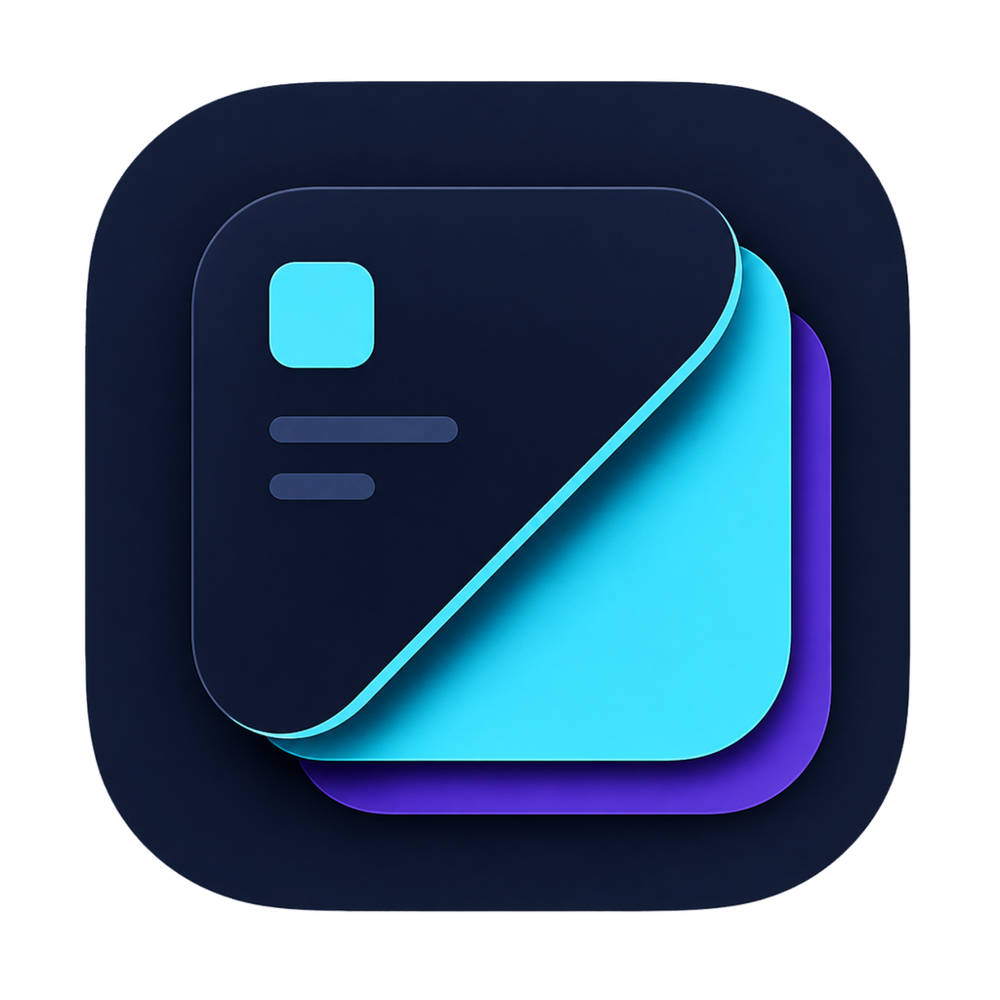
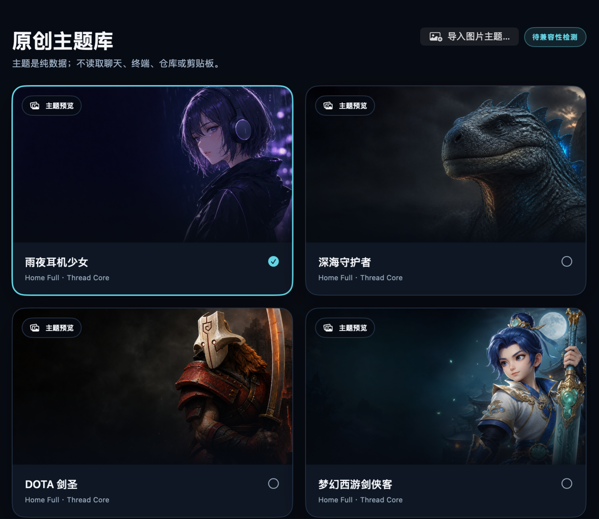
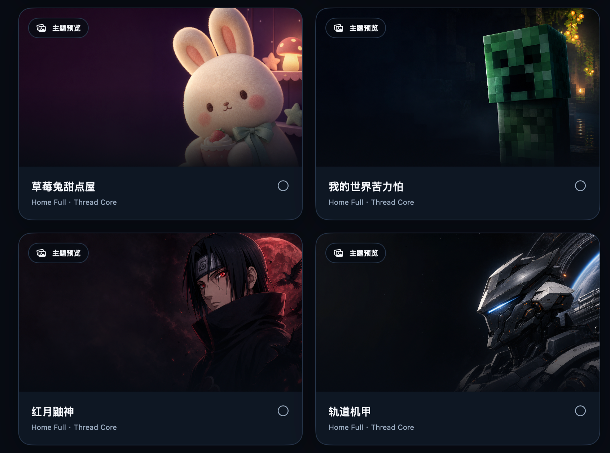

# ChatGPT Skin Studio

<p align="center">
  
</p>

**A native macOS theme controller that applies reversible, full-surface skins to a verified installation of the ChatGPT desktop app.**

[简体中文](README.zh-CN.md) · [Latest release](https://github.com/zuuzii-org/chatgpt-avatar/releases/latest) · [Privacy](PRIVACY.md) · [Security](SECURITY.md)

> [!IMPORTANT]
> ChatGPT Skin Studio is an independent, unofficial project. It is not affiliated with, endorsed by, or supported by OpenAI. “ChatGPT,” “Codex,” and related names and marks belong to their respective owners.

ChatGPT Skin Studio is a source-available macOS utility for people who want a themed ChatGPT desktop experience without patching `app.asar`, replacing the application binary, or changing the official app's code signature. A skin is applied through a user-authorized, loopback-only Chrome DevTools Protocol (CDP) session and can be removed by restoring the native interface.

## Screenshots

<p align="center">
  
</p>

<p align="center"><em>Theme library — a selected skin is clearly marked, while every card keeps the artwork and supported surface modes visible.</em></p>

<p align="center">
  
</p>

<p align="center"><em>Bundled themes — local image-driven themes remain data-only and are validated before use.</em></p>

## At a glance

| | v0.1.0 Public Beta |
|---|---|
| Host | macOS 14 or later |
| Target app | Verified `/Applications/ChatGPT.app` installation |
| Controller UI | Simplified Chinese |
| Compatibility | Runtime structural probe; no static ChatGPT version/build allowlist |
| Theme scope | Home Full, Thread Core, sensitive routes token-only |
| Updates | Sparkle 2 integration; enabled only by a release with a valid EdDSA key and published appcast |
| Distribution | [GitHub Releases](https://github.com/zuuzii-org/chatgpt-avatar/releases) |
| License | No license file is currently provided; see [License status](#license-status) |

## What it does

- Themes the real ChatGPT desktop interface rather than displaying a mock window.
- Adds a full-viewport hero treatment, glass sidebar, themed native suggestion cards, composer styling, brand mark, and optional icon/text accents on supported Home surfaces.
- Uses a quieter Core treatment for threads and preserves native semantics on Diff, Review, Terminal, Settings, Pull Request, and Approval surfaces.
- Lets you switch between validated themes without another ChatGPT restart while the managed session remains active.
- Imports a local static image as a theme, re-encodes it on-device, removes image metadata, and lets you set the visual focal point.
- Includes a Sparkle 2 update controller that stays disabled when its release public key is absent or invalid.
- Removes its owned styles, nodes, reload scripts, payloads, and bindings when restoring or failing closed.

## What it does not do

- It does not patch, redistribute, or replace files inside `ChatGPT.app`.
- It does not promise compatibility with every current or future ChatGPT build.
- It does not deeply restyle every route; sensitive and narrow layouts intentionally retain more of the native UI.
- It does not install a watchdog or silently restart ChatGPT.
- It is not an OpenAI product, plugin, extension, or support channel.

## How it works

1. The controller verifies the exact application path, Bundle ID, OpenAI Team ID, and code signature of `ChatGPT.app`.
2. After explicit confirmation, it asks the current ChatGPT process to quit and launches a managed instance with a random loopback CDP port.
3. A structural adapter classifies the current route and renderer shape without using the ChatGPT version number as an admission rule.
4. The injector attaches validated local CSS, image data, and optional theme extensions to project-owned DOM nodes and attributes.
5. Stable incompatibility or runtime failure triggers cleanup and an attempt to return ChatGPT to a normal launch.

The version and build remain diagnostic metadata. A newly updated ChatGPT build is allowed to run the compatibility probe; compatible structures proceed, while repeated stable mismatches are reported as incompatible. This is graceful degradation, not a guarantee that every future build will work.

## Surface behavior

| Surface | Mode | Behavior |
|---|---|---|
| Home / New Task at `>= 1024px` | Full | Hero, atmosphere, glass surfaces, themed native cards, composer, and optional brand/icon accents |
| Thread at `>= 1024px` | Core | Lower-noise background, sidebar, composer, and message readability treatment |
| Diff / Review / Terminal / Settings / PR / Approval | token-only | Conservative color tokens; native semantic colors and controls stay visible |
| Any surface below `1024px` | token-only | Decorative and hero layers are suppressed in favor of usability |

## Bundled themes

The v0.1.0 release is prepared with ten bundled themes:

- Rainy Night Headphone Girl (`anime-rain-girl`)
- Deep Sea Guardian (`deep-sea-guardian`)
- DOTA Juggernaut (`dota-juggernaut`)
- Fantasy Westward Journey Swordsman (`dream-westward-journey`)
- Ink White Deer (`ink-white-deer`)
- KartRider Night Track (`kartrider-dao`)
- Strawberry Bunny Dessert Shop (`kawaii-strawberry-bunny`)
- Minecraft Creeper (`minecraft-creeper`)
- Naruto Itachi (`naruto-itachi`)
- Orbital Mecha (`orbital-mecha`)

Some bundled theme names and artwork reference third-party franchises. They are unofficial and do not imply ownership, authorization, sponsorship, or endorsement. See [THIRD_PARTY_NOTICES.md](THIRD_PARTY_NOTICES.md) before redistribution or commercial use.

## Install

### From a release

1. Open the [latest GitHub Release](https://github.com/zuuzii-org/chatgpt-avatar/releases/latest).
2. Download the DMG attached to that release. GitHub's automatic “Source code” archives are not app installers.
3. Open the DMG and drag **ChatGPT Skin Studio** to `/Applications`.
4. Launch the app and keep its menu bar item available while a skin session is active.

Signing, notarization, checksums, and automatic-update availability are release-specific. Treat them as supported only when the individual Release notes explicitly confirm them. Do not bypass a macOS security warning for an artifact from an untrusted source.

### Requirements

- macOS 14 or later.
- The official desktop app at `/Applications/ChatGPT.app`.
- Permission to interrupt and relaunch ChatGPT when applying the first skin or restoring the native interface.

> [!WARNING]
> Applying the first skin and restoring the native interface interrupt the current ChatGPT process. Finish or save important work before confirming either action. The controller does not force-quit an unresponsive process.

## Use

1. Open ChatGPT Skin Studio and select a theme.
2. Choose **应用到 ChatGPT…** (Apply to ChatGPT).
3. Read the restart disclosure and confirm only when the current ChatGPT task can be interrupted.
4. Once active, choose another theme and use **无重启切换主题** (Switch without restart) to change it in the same managed session.
5. Choose **恢复原生界面** (Restore native interface) before quitting the controller when you want to remove the skin cleanly.

If the skin disappears after ChatGPT itself exits or restarts, open the controller and apply it again. The visual injection is session-scoped; the app does not permanently modify ChatGPT.

## Import a custom image theme

Choose **导入图片主题…** (Import image theme), then select a static PNG, JPEG, WebP, HEIC, or HEIF image. The importer:

- validates that the source is a regular, single-frame local image;
- decodes and re-encodes it locally as PNG or JPEG;
- removes source metadata during re-encoding;
- constrains size and pixel count before storage;
- saves the validated theme under `~/Library/Application Support/ChatGPTSkinStudio/Themes`;
- never restarts ChatGPT merely to preview or save the import.

Only use artwork that you have the right to use. Imported content remains your responsibility.

## Privacy and security model

- No project-operated analytics, advertising, telemetry endpoint, or cloud theme service is present in the skin engine.
- CDP discovery and WebSocket traffic are restricted to a randomly selected `127.0.0.1` listener whose owning process is verified.
- Structural compatibility probes use route, viewport, script counts, and selector cardinality—not conversation text.
- Optional visual extensions may compare short, visible navigation or suggestion labels locally to position theme-owned marks and icons. Those labels are not sent to project maintainers.
- The controller is not designed to read or export chats, terminal output, repository content, clipboard data, API keys, `localStorage`, or ChatGPT network requests.
- Runtime diagnostics are stored locally in `~/Library/Application Support/ChatGPTSkinStudio/diagnostics.log` with a size-capped previous log.

Read the full [Privacy Policy](PRIVACY.md) and [Security Policy](SECURITY.md).

## Compatibility FAQ

### Does ChatGPT Skin Studio support the latest ChatGPT desktop app?

It does not use a fixed version allowlist. Each installed build is admitted to a runtime structural probe. If the required structure still matches, the skin can apply; if a stable mismatch is detected, the controller cleans up and reports incompatibility. A future update can therefore work without a Skin Studio release, but it is never guaranteed.

### Does it modify or resign `ChatGPT.app`?

No. The controller verifies the official app and applies session-scoped renderer styling through a local debugging connection. It does not edit `app.asar`, replace the binary, or change the official code signature.

### Does it read my conversations?

The compatibility probe does not inspect conversation text. The optional theme-extension layer may locally match short UI labels such as navigation or suggestion titles to position visual accents; it is not designed to read, store, or transmit chat content. See [PRIVACY.md](PRIVACY.md) for the exact boundary.

### Why does applying a skin restart ChatGPT?

The controller needs to launch a verified, managed ChatGPT process with a loopback CDP listener. That listener cannot be added safely to an already-running process. Explicit confirmation is required for the initial apply and for restoration.

### Can I switch themes without restarting?

Yes, after the first theme is active and while the same managed ChatGPT session remains valid. Switching uses strict cleanup and attempts to restore the previous theme if the new one fails.

### Is the skin permanent?

No. It is attached to the current managed renderer session. Restoring the native interface, quitting/restarting ChatGPT, or a fail-closed cleanup removes it.

### Why are some pages less heavily themed?

Diffs, terminals, settings, approvals, pull requests, and narrow layouts retain a token-only treatment so native semantics, contrast, and risk indicators remain legible.

### How do automatic updates work?

The app integrates Sparkle 2 and exposes **Check for Updates…** only when the release build contains a valid EdDSA public key. An update is available only after the project publishes the signed archive and `appcast.xml` described by that Release. If either requirement is missing, update manually from GitHub Releases.

## Build and test from source

Requirements: Xcode with a Swift 6 toolchain and [XcodeGen](https://github.com/yonaskolb/XcodeGen).

```bash
xcodegen generate
xcodebuild -project ChatGPTSkinStudio.xcodeproj \
  -scheme ChatGPTSkinStudio \
  -destination 'platform=macOS' \
  CODE_SIGNING_ALLOWED=NO \
  SWIFT_TREAT_WARNINGS_AS_ERRORS=YES \
  test
```

The standard suite skips live tests that launch ChatGPT. Do not run live or production E2E tests while important ChatGPT work is active. Build success does not prove visual compatibility with a logged-in renderer.

## Documentation

- [Architecture and trust boundaries](docs/ARCHITECTURE.md)
- [Privacy Policy](PRIVACY.md)
- [Security Policy](SECURITY.md)
- [Changelog](CHANGELOG.md)
- [Third-party notices and trademarks](THIRD_PARTY_NOTICES.md)
- [Implementation contract (Chinese)](ChatGPT_Skin_Studio_实施方案.md)

## License status

This repository currently does **not** include a license file. Public source visibility does not by itself grant permission to copy, modify, redistribute, or commercially use the code or bundled artwork. Third-party marks and referenced properties remain the property of their respective owners.

For defects, compatibility reports, and documentation issues, use [GitHub Issues](https://github.com/zuuzii-org/chatgpt-avatar/issues). For a suspected vulnerability, follow [SECURITY.md](SECURITY.md) instead of filing a public issue.
